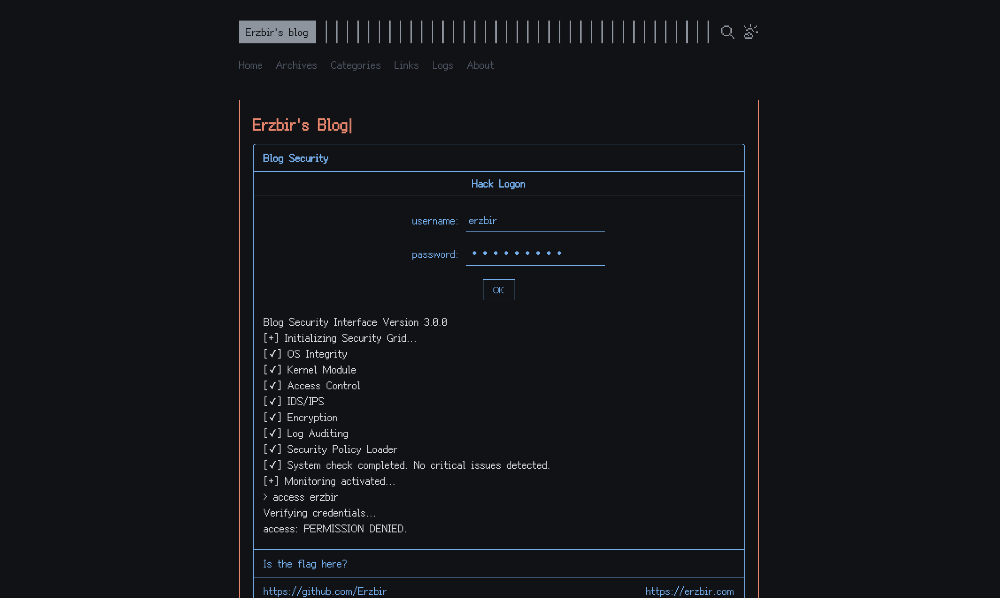
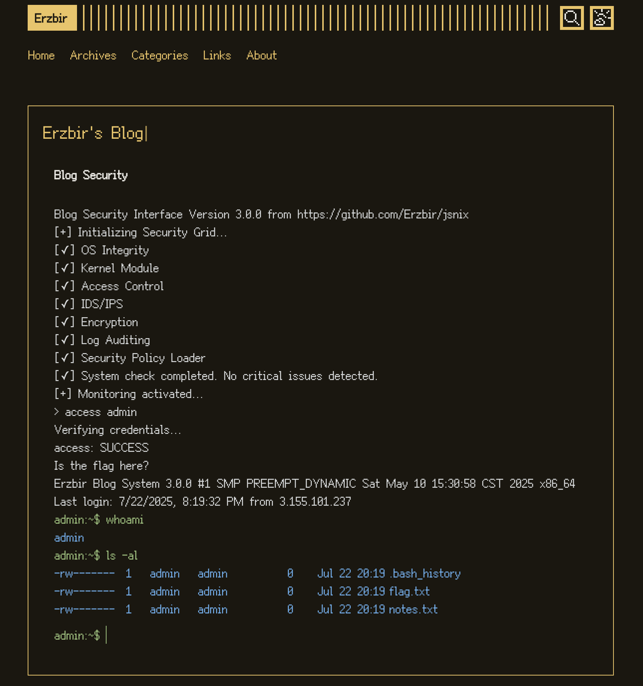

一个运行在浏览器的模拟终端, 不需要任何依赖, 模拟了 Linux 的一些系统调用, 由于水平有限, 并非完全模拟

目前尚未完善, 也有很多功能都没有实现

[system](src/system): 模拟系统

- [fs.js](src/system/fs.js) - 提供文件操作, 以及一些封装
- [unistd.js](src/system/unistd.js) - 系统调用接口
- [system.js](src/system/system.js) - 提供运行的入口
- [shadow.js](src/system/shadow.js) - shadow 文件相关操作
- [pwd.js](src/system/pwd.js) - passwd 文件相关操作
- [grp.js](src/system/grp.js) - group 文件相关操作

[system/sys](src/system/sys): 具体的实现, 库通过 [syscall.js](src/system/sys/syscall.js) 中的 `syscall` 函数来调用被注册的系统函数

[terminal](src/terminal): 终端的实现

可以把这个放在你的博客:

## 使用方法

1. 使用了 ES Modules, 使用 esbuild 构建 [index.js](src/index.js) 的 bundle 后直接将 script 标签插入网页

2. 在你需要展示的位置插入一个标签: `

`

id 值可以通过 [config.js](src/terminal/config.js) 中的 `hook` 字段自定义

## 修改

terminal 的模板以及各种配置信息都在 [config.js](src/config.js) 中修改

样式布局在 [frontend.js](src/terminal/frontend.js) 中修改

新增命令需要调用 [terminal.js](src/terminal/terminal.js) 中的 `registerCommand` 函数注册