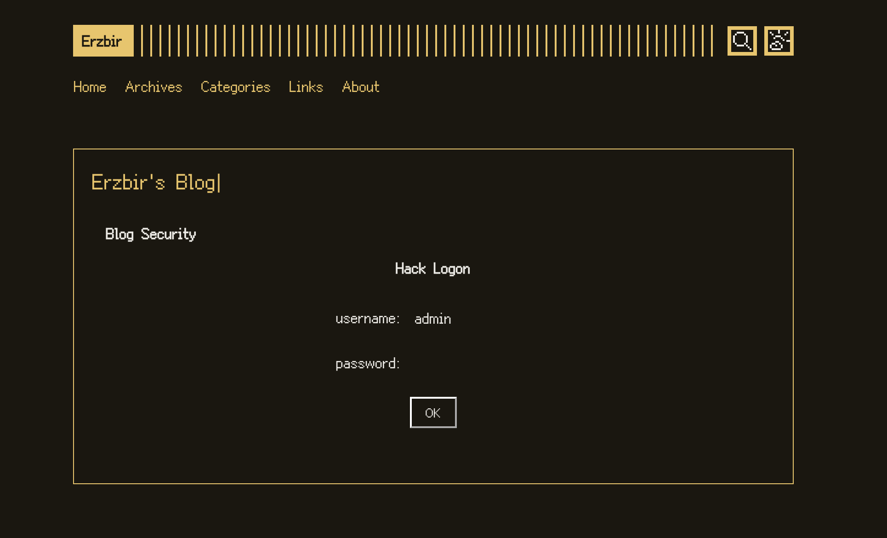

一个运行在浏览器的模拟终端, 不需要任何依赖

一个示例: [https://erzbir.com](https://erzbir.com)

密码是 admin

## 使用方法

1. 构建项目: `make`, dist 目录下是混淆后的产物
2. 将构建好的 bundle.js 或 main.min.js 中的内容放进 script 标签: `<script>xxxx</script>`
3. 将这个 `script` 标签插入你的网页
4. 在你需要展示的位置插入一个标签: `<div id=terminal-banner></div>`

可以在 config.js 中通过 `hook` 字段自定义容器的 id

可以把这个放在你的博客:




## 修改

### 配置修改

在 config.js 中调整终端的模板和配置信息。

### 样式布局

在 frontend.js 中修改终端的样式和布局。

### 新增命令

继承 `Command` 实现 `execute` 方法, 构造函数中的第一个字段 `match` 用于匹配这个命令

例如:

```javascript
export class Hello extends Command {
    constructor() {
        super("hello", "hello", "hello");
    }

    execute(args) {
        return `hello`;
    }
}
```

调用 `registerCommand` 函数注册命令:

```javascript
import {registerCommand} from "./terminal/terminal.js";

registerCommand(new Hello());
```

## 开发计划
- 实现网络请求, 以供访问网站资源
- 更贴近模拟终端的实现
- 支持更多命令